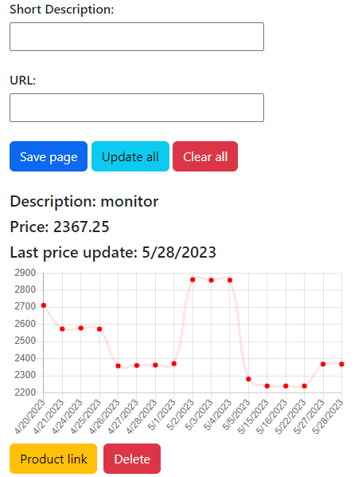

# Busted

### I made this chrome extension to track the price of the products I want to buy.

### As you can see in the picture below you can add your url and a description to it. After you hit the "Save page" button the url will be saved and you can update/get the price of all products for the current day when you click the button "update all".

### You can add as many links as you want. You can also see for every product the description, the last time the price was updated, a chart with the date and the price for that specific day. (I also add the data for the product that I was tracking as an example)

### You can install it by going to chrome extensions and add the folder "src" as an unpacked extesion.

### Things to do in the near future
* update the list of suported websites (for now only one website is supported)
* make the requests automatically and not by clicking every day the "update all" button (I wanted to do it on the client side but the requests are blocked by CORS)
* when we'll do the upper step maybe we can add in the chart the price prediction of the product for the next day but we need more data for that